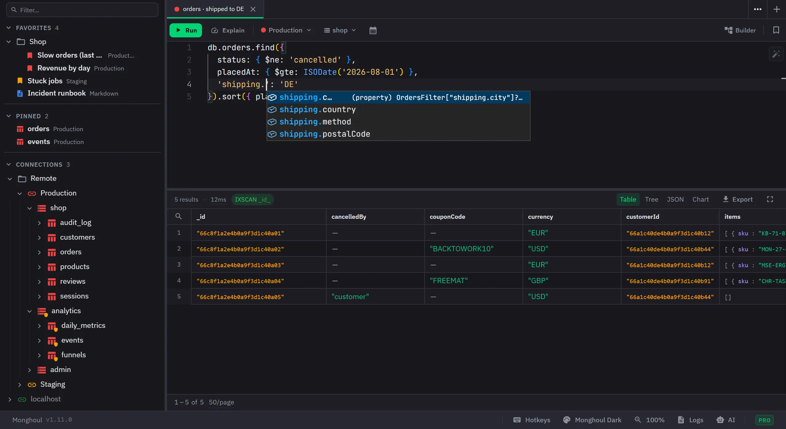

  

<h1 align="center">Monghoul</h1>

  A fast MongoDB IDE for developers who care about their tools.

  <a href="https://monghoul.com">Website</a> ·
  <a href="https://monghoul.com/product/">Product</a> ·
  <a href="https://monghoul.com/docs/">Docs</a> ·
  <a href="https://monghoul.com/download/">Download</a> ·
  <a href="https://monghoul.com/pricing/">Pricing</a> ·
  <a href="https://monghoul.com/releases/">Changelog</a>

  
  
  
  
  

---

## What this repository is

This is where Monghoul is **released** and where its **issues** are tracked. The application source
is not here.

- [Releases](https://github.com/Kontsedal/monghoul-public/releases) — every version, with installers
  for all three platforms
- [Issues](https://github.com/Kontsedal/monghoul-public/issues) — bug reports and feature requests

## What is Monghoul?

A desktop MongoDB client built with [Tauri](https://tauri.app) and [Bun](https://bun.sh). It uses
the web view your operating system already ships instead of bundling a browser, which is why the
installer is 38 MB rather than the size an Electron app of the same scope would be.

Your data stays on your machine. Connection profiles, tabs, query history and themes live in a
local SQLite database, and there is no account to create.

### Highlights

- **Schema-aware autocomplete** that follows fields through `$lookup`, `$group`, `$project`,
  `$facet` and the rest, so a joined field completes eight lines later
- **Visual aggregation builder** with drag-and-drop stages, a per-stage preview, a `$lookup` form
  helper, and code that stays in sync with the visual pipeline
- **Six chart types** — bar, horizontal bar, line, pie, scatter and area — with stacking on three
  of them, dual axis, date aggregation and PNG export
- **Cluster monitoring** with live metrics, slow-query analysis and the database profiler
- **70+ MCP tools** for AI assistants (Claude, Cursor, Windsurf, and any MCP client), behind a
  permission model and an approval queue
- **Eleven built-in themes** and an editor that derives a whole token set from three colours
- **Import and export** in JSON, CSV and Excel, plus cross-instance collection copy
- **Eight authentication methods** — no auth, username and password, SCRAM-SHA-1 and SCRAM-SHA-256,
  and on Pro X.509, LDAP, Kerberos and AWS IAM
- **SSH tunnelling** and TLS with custom certificates
- **Write protection**, per connection and narrowable to particular databases and collections,
  enforced at the driver rather than by reading your query

[The product pages](https://monghoul.com/product/) walk through these by workflow.
[The documentation](https://monghoul.com/docs/) is the manual.

## Download

| Platform | Format | Install notes |
|---|---|---|
| Windows | `.exe` installer, `.msi` for deployment, or `winget install Monghoul.Monghoul` | [Windows](https://monghoul.com/download/windows/) |
| macOS | `.dmg` for Apple silicon and Intel, signed and notarized | [macOS](https://monghoul.com/download/mac/) |
| Linux | `.AppImage`, `.deb` or `.rpm` | [Linux](https://monghoul.com/download/linux/) |

The Linux `.AppImage` arrived in 1.12.2. It runs on any distribution and it is the only Linux
format the in-app updater can replace. A `.deb` or `.rpm` install updates through your package
manager instead.

**[Download the latest release](https://github.com/Kontsedal/monghoul-public/releases/latest)**, or
see [monghoul.com/download](https://monghoul.com/download/) for the installers and the size of each.

Requires **MongoDB 4.4 or newer**. Monghoul refuses an older server with an explicit error rather
than connecting and failing in unclear ways later. See
[system requirements](https://monghoul.com/system-requirements/).

## Free and Pro

The free tier is not a trial. It does not expire and it needs no card.

| | Free | Pro |
|---|---|---|
| Saved connections | 8 | Unlimited |
| Favorite queries | 5 | Unlimited |
| Pinned collections | 5 | Unlimited |
| Open tabs | No limit | No limit |
| Multi-panel layout, sidebar folders | ✓ | ✓ |
| Query editor, autocomplete, aggregation builder | ✓ | ✓ |
| Tree, table and JSON views | ✓ | ✓ |
| Schema analysis | 500 sampled docs | Unlimited |
| Generated test documents | 500 | 100,000 |
| Operation log entries | 250 | Unlimited |
| Authentication | No auth, user and password, SCRAM | Plus X.509, LDAP, Kerberos, AWS IAM |
| Charts and visualization | — | ✓ |
| Cluster monitoring | — | ✓ |
| AI access, the MCP server | — | ✓ |
| Document diff | — | ✓ |
| Custom themes | — | ✓ |
| Detached windows | — | ✓ |
| Excel import and export | — | ✓ |
| Cross-instance collection copy | — | ✓ |
| Database-level export and import | — | ✓ |

Every eligible device also gets a **14-day Pro trial, once**, with no email address and no card.
Full details on [the pricing page](https://monghoul.com/pricing/) and in
[Free and Pro](https://monghoul.com/docs/concepts/free-and-pro/).

## Reporting a bug or asking for a feature

[Open an issue](https://github.com/Kontsedal/monghoul-public/issues/new/choose). The forms ask for
what is actually needed to reproduce a problem, so filling one in beats a blank issue.

- **Bugs** — the app version, your OS, and the steps that produce it. The Operation Logs panel
  often holds the server's own message, which is the useful part.
- **Features** — describe the problem you are trying to solve rather than the solution you have in
  mind. It leaves room for a better answer.

For anything security related, see [SECURITY.md](SECURITY.md). Please do not open a public issue
for a vulnerability.

## Free browser tools

No install, nothing uploaded, and they run entirely in the page:

[Explain plan visualizer](https://monghoul.com/explain-visualizer/) ·
[SQL to MongoDB](https://monghoul.com/sql-to-mongodb/) ·
[Extended JSON converter](https://monghoul.com/ejson-converter/) ·
[ObjectId decoder](https://monghoul.com/objectid-decoder/) ·
[Connection string parser](https://monghoul.com/connection-string-parser/) ·
[BSON size calculator](https://monghoul.com/bson-size-calculator/) ·
[Aggregation cheat sheet](https://monghoul.com/aggregation-cheat-sheet/)

## Links

[Website](https://monghoul.com) ·
[Documentation](https://monghoul.com/docs/) ·
[Changelog](https://monghoul.com/releases/) ·
[Support](https://monghoul.com/support/) ·
[Privacy](https://monghoul.com/privacy/) ·
[Terms](https://monghoul.com/terms/) ·
[EULA](https://monghoul.com/eula/)
